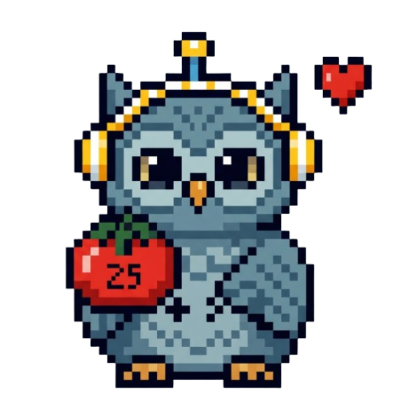

<p align="center">
  
</p>

<h1 align="center">FocusPals</h1>

<p align="center">
  Thú cưng desktop + Pomodoro timer cho Windows.<br>
  Một con pet nổi trên màn hình — click để focus, đếm ngược, phát nhạc, đổi animation theo trạng thái.
</p>

<p align="center">
  
  
  
  <a href="LICENSE"></a>
</p>

<p align="center">
  Render bằng <b>PNG sprite / spritesheet</b> (Qt thuần, nhẹ) — không dùng Chromium.
  Tương thích pet pack format <b>petdex</b>.
</p>

---

## ✨ Tính năng

- 🐾 Pet nổi trên cùng, trong suốt, kéo thả, nhớ vị trí
- ⏱️ Timer focus (preset 25/50 phút hoặc tùy chỉnh) + popup gọn
- 🎵 Phát nhạc focus loop, chỉnh âm lượng (nhạc bundle hoặc thêm từ máy)
- 🎬 Animation đổi theo trạng thái: `idle / focus / break / done`
- 🎨 Skin tùy biến: PNG rời hoặc spritesheet, thả folder vào là chạy
- 🔔 Toast + âm báo khi hết giờ, tray icon, autostart cùng Windows
- 💾 Lưu lịch sử focus (SQLite) tại `%APPDATA%\AgentPetTimer\`

## 🚀 Bắt đầu

```powershell
pip install -r requirements.txt
python main.py
```

> **Yêu cầu:** Python 3.10+, Windows. (`requirements.txt`: PySide6, plyer, pyinstaller)

## 🎮 Cách dùng

| Thao tác | Kết quả |
|---|---|
| **Click** pet | Mở / đóng popup timer |
| **Kéo** pet | Di chuyển (tự nhớ vị trí) |
| **Right-click** pet | Menu: Timer / Cài đặt / Thoát |
| Popup → chọn phút, nhạc, âm lượng → **Bắt đầu** | Vào phiên focus |
| Hết giờ | Pet ăn mừng 🎉, nhạc dừng, toast + tiếng báo |

## 🎨 Thêm pet / nhạc

- **Pet** — thả vào `assets/pet/<tên_skin>/`: PNG rời (`idle/focus/break/done.png`) hoặc 1 file `spritesheet.webp`. Tự hiện trong Cài đặt; thiếu → fallback emoji.
  Hướng dẫn chi tiết + **prompt tạo pet bằng AI**: [assets/pet/README.md](assets/pet/README.md).
- **Nhạc** — thả `.mp3/.wav/.ogg` vào `assets/music/`. Xem [assets/music/README.md](assets/music/README.md).

> Hoặc dùng thẳng trang **✨ Tạo pet** trong Cài đặt: upload spritesheet/PNG → tự xoá nền caro → kiểm tra format → lưu skin.

## 📦 Build .exe

```powershell
powershell -ExecutionPolicy Bypass -File build.ps1
```

Ra `dist/AgentPetTimer.exe` (onefile, đã exclude QtWebEngine cho nhẹ).

## 🗂️ Cấu trúc

```
main.py                  # entry point
src/
├─ core/                 # logic thuần, không UI
│  ├─ states.py          #   PetState: idle/focus/break/done
│  ├─ timer.py           #   countdown
│  ├─ storage.py         #   settings JSON + history SQLite
│  └─ paths.py           #   resolve asset path (dev + PyInstaller)
├─ services/             # tích hợp hệ thống
│  ├─ music_player.py    #   QtMultimedia loop nhạc
│  ├─ notify.py          #   toast (plyer)
│  └─ autostart.py       #   chạy cùng Windows (registry)
└─ ui/                   # Qt widgets
   ├─ pet_window.py      #   cửa sổ pet: frameless, transparent, drag/click
   ├─ pet_animator.py    #   render sprite (QLabel + QTimer) + slice spritesheet
   ├─ settings_dialog.py #   cài đặt (skin/size/opacity/nhạc/autostart)
   ├─ timer_popup.py     #   popup chọn thời gian
   ├─ tray.py            #   system tray
   └─ theme.py           #   QSS style
assets/pet/              # pet skins (user thêm)
assets/music/            # nhạc (user thêm)
```

## 🙏 Credits

Tương thích pet pack format **petdex** (spritesheet cắt bằng alpha-gutter: mỗi hàng = 1 clip, mỗi cột = 1 frame).

## 📄 License

[MIT](LICENSE) © 2026 Nam TRAN
